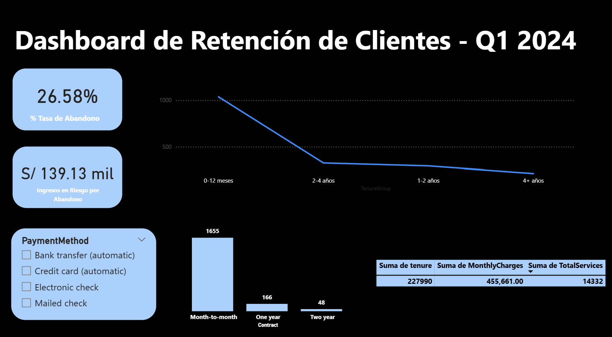

# 📊 Análisis de Fuga de Clientes (Telco Churn)

## 📝 Descripción del Proyecto
Este proyecto analiza los motivos por los cuales los clientes de una empresa de telecomunicaciones cancelan sus servicios. Utilicé **Python** para procesar más de 7,000 registros y **Power BI** para crear un tablero de control que identifica a los clientes en riesgo.

## 🛠️ Herramientas Utilizadas
* **Python (Pandas, Seaborn):** Limpieza de datos y análisis estadístico.
* **Power BI:** Visualización de datos y KPIs de negocio.
* **Google Colab:** Procesamiento inicial del dataset.

## 💡 Hallazgos Principales (Insights)
* **Contratos:** El 88% de las fugas provienen de contratos **mes a mes**.
* **Método de Pago:** Los clientes que pagan con **Electronic Check** tienen una tasa de abandono del **45%**.
* **Antigüedad:** Los clientes con menos de **12 meses** de contrato son los más propensos a irse.

## 🖥️ Visualización del Dashboard
A continuación, se muestra el análisis visual realizado en Power BI:

## 🚀 Cómo Reproducir el Análisis
1. Descarga `analisis_limpieza.py` y ejecútalo para limpiar los datos.
2. El resultado será `Telco_Churn_Clean.csv`.
3. Abre el archivo de Power BI y vincula el CSV limpio para ver las gráficas.
